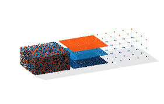

# Feature Engineering
---

## Models and Features

> the process involves two mathematical entities that are the bread and butter of machine learning.

**Mathematical/Statistical Modeling** - describes the relationships between different aspects of data.

**Feature** - is a numeric representation of raw data.

**Feature Engineering** - the process of formulating the most appropriate features given the data, the model and the task.

**[02_Simple Numbers](https://github.com/CFerraren/Feature-Engineering-for-Machine-Learning/tree/master/02_Simple%20Numbers) Discusses number of common numeric feature engineeringtechniques, such as quantization, scaling(normalization), log transforms(a type of power transform), and interaction features, and gave a brief summary of feature selection techniques, necessary for handling large quantities of intreaction features.**

1. [Binarization](https://github.com/CFerraren/Feature-Engineering-for-Machine-Learning/blob/master/02_Simple%20Numbers/2-1_Binarization.ipynb)

2. [Quantization_Binning](https://github.com/CFerraren/Feature-Engineering-for-Machine-Learning/blob/master/02_Simple%20Numbers/2-2_Quantization_Binning.ipynb)

3. [Fixed-Width Bins (Quantizing)](https://github.com/CFerraren/Feature-Engineering-for-Machine-Learning/blob/master/02_Simple%20Numbers/2-3_Fixed-Width%20Bins%20(Quantizing).ipynb)

4. [Quantile Binning](https://github.com/CFerraren/Feature-Engineering-for-Machine-Learning/blob/master/02_Simple%20Numbers/2-4_Quantile%20Binning.ipynb)

5. [Binning Counts by Quantiles](https://github.com/CFerraren/Feature-Engineering-for-Machine-Learning/blob/master/02_Simple%20Numbers/2-5_Binning%20Counts%20by%20Quantiles.ipynb)

6. [Visualizing the Review Counts Distribution](https://github.com/CFerraren/Feature-Engineering-for-Machine-Learning/blob/master/02_Simple%20Numbers/2-6_Visualizing%20the%20Review%20Counts%20Distribution.ipynb)

7. [News Article Popularity](https://github.com/CFerraren/Feature-Engineering-for-Machine-Learning/blob/master/02_Simple%20Numbers/2-7_News%20Article%20Popularity.ipynb)

8. [Yelp Review with Log Transform](https://github.com/CFerraren/Feature-Engineering-for-Machine-Learning/blob/master/02_Simple%20Numbers/2-8_Yelp%20Review%20with%20Log%20Transform.ipynb)

9. [Predict News Article Popularity with Log Transform](https://github.com/CFerraren/Feature-Engineering-for-Machine-Learning/blob/master/02_Simple%20Numbers/2-9_Predict%20News%20Article%20Popularity%20with%20Log%20Transform.ipynb)

10. [Visualized using Scatter Plot the News Article Popularity with Applied Log Transform](https://github.com/CFerraren/Feature-Engineering-for-Machine-Learning/blob/master/02_Simple%20Numbers/2-10_Visualized%20using%20Scatter%20Plot%20the%20News%20Article%20Popularity%20with%20Applied%20Log%20Transform.ipynb)

11. [Visualizing the Correlation between Input and Output In Yelp Business Review](https://github.com/CFerraren/Feature-Engineering-for-Machine-Learning/blob/master/02_Simple%20Numbers/2-11_Visualizing%20the%20Correlation%20between%20Input%20and%20Output%20In%20Yelp%20Business%20Review.ipynb)
12. [Box-Cox Transformation](https://github.com/CFerraren/Feature-Engineering-for-Machine-Learning/blob/master/02_Simple%20Numbers/2-12_Box-Cox%20Transformation.ipynb)

13. [Feature Scaling](https://github.com/CFerraren/Feature-Engineering-for-Machine-Learning/blob/master/02_Simple%20Numbers/2-13_Feature%20Scaling.ipynb)

14. [Interactions Features in Prediction](https://github.com/CFerraren/Feature-Engineering-for-Machine-Learning/blob/master/02_Simple%20Numbers/2-14_Interactions%20Features%20in%20Prediction.ipynb)